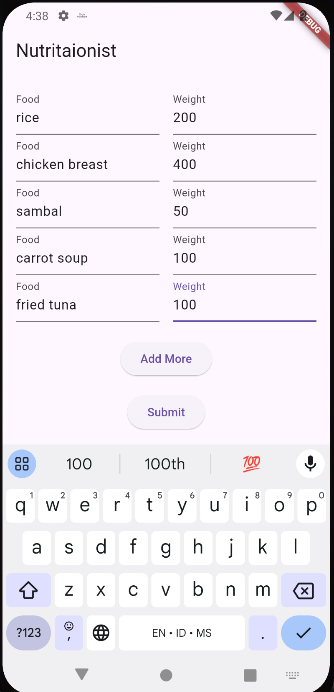
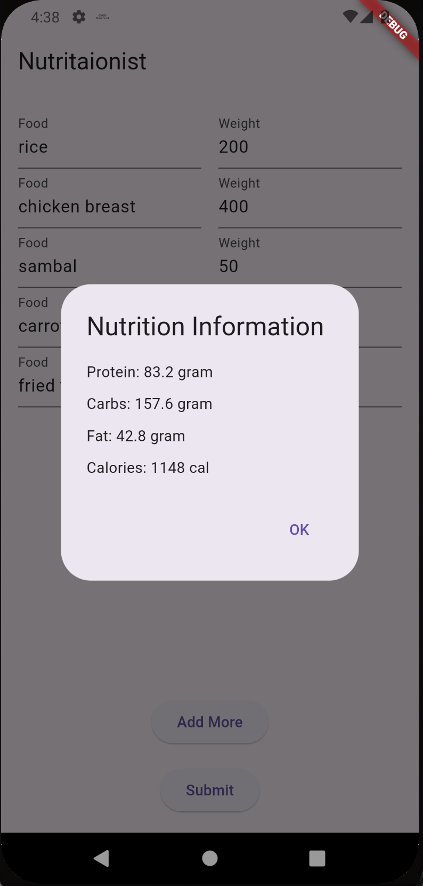

# nutritionaist

AI nutritionist
an ai app to help you count nutrition and calories in your food

## Demo
| input food                 | result                     |
|----------------------------|----------------------------|
|  |  |

## Getting Started

This repository created for supplement the talk I gave in flutter jakarta community
this is the slide: https://docs.google.com/presentation/d/1zSLVRIxDQERXDCDcrTwgTzIu_VaMCoPHvgSeQbm-1Bw/edit#slide=id.g3261393262e_0_1795

to be able to make the app run, you need to configure your own firebase project and enable the firebase vertex configuration
You will need to create billing account in google cloud console. 
for detailed steps configuring the firebase project, it's in the slide number 20 - 22